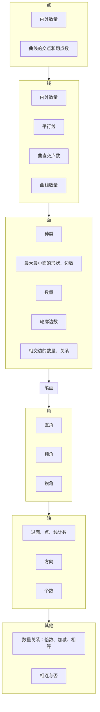

```mermaid
flowchart TD
    subgraph 点
        A1[内外数量]
        A2[曲线的交点和切点数]
    end
    subgraph 线
        B1[内外数量]
        B2[平行线]
        B3[曲直交点数]
        B4[曲线数量]
    end
    subgraph 面
        C1[种类]
        C2[最大最小面的形状、边数]
        C3[数量]
        C4[轮廓边数]
        C5[相交边的数量、关系]
    end
    subgraph 笔画
    end
    subgraph 角
        E1[直角]
        E2[钝角]
        E3[锐角]
    end
    subgraph 轴
        F1[过面、点、线计数]
        F2[方向]
        F3[个数]
    end
    subgraph 其他
        G1[数量关系：倍数、加减、相等]
        G2[相连与否]
    end

    点 --> 线
    线 --> 面
    面 --> 笔画
    笔画 --> 角
    角 --> 轴
    轴 --> 其他
```

